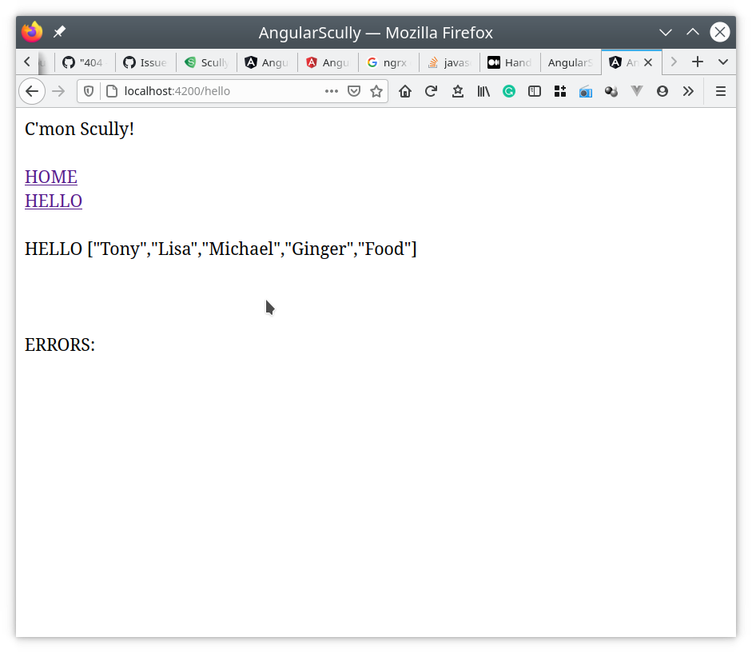
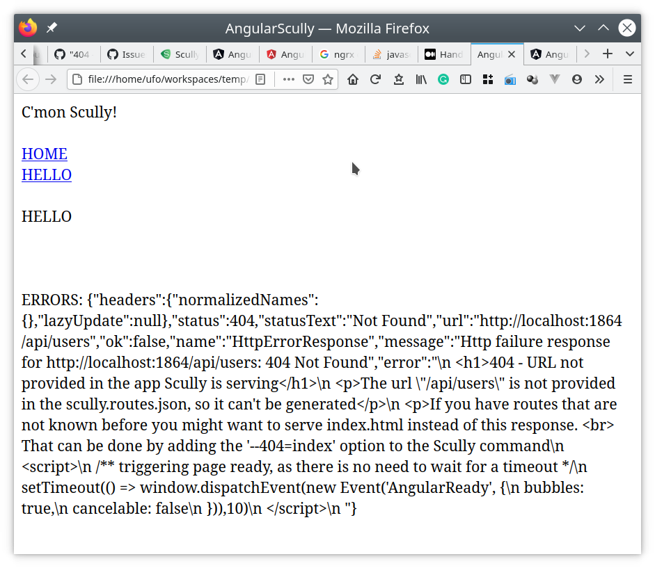

# angular-scully-issue

Reproducer for [Scully issue 1298](https://github.com/scullyio/scully/issues/1298).

## Steps to reproduce the issue:
- Enter the `server` directory and start the backend:
  `npm start`
  This starts an express http server at port 3000. It has a single REST enpoint at `/api/users`
- In another terminal, while the backend is up and running, enter the `angular-scully` directory and:
    - build the angular application:
      `npm run build`
    - when the build is finished, launch the scully build:
      `npm run scully`

## Expected behavior:
The following is the "normal" `hello` page as shown by angular without scully prerendering.

_Angular page:_

The list of names [Tony, Lisa, Michael, Ginger, Food] was loaded from the express backend.

I expect the Scully prenderered page to be exactly the same as the Angular one.

## Current (wrong) behavior:

The Scully prerendered page shows an error as it was not able to contact the backend during rendering.

_Scully page:_
